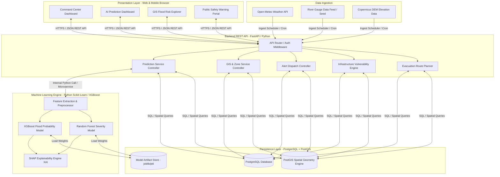
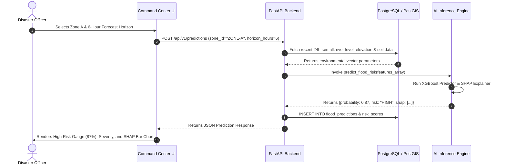
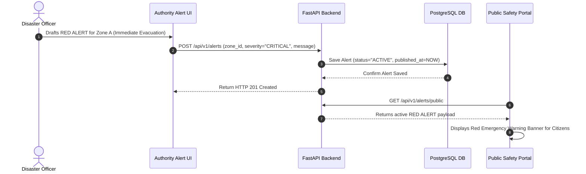

# Document 02 — System Architecture & Technical Design

**Project Title:** AI-Powered Flood Prediction & Early Warning System  
**Document Version:** 1.0.0  
**Date:** September 9, 2026  
**Status:** Final Draft  

---

## 1. Architecture Overview & Core Principles

The AI-Powered Flood Prediction & Early Warning System is engineered as a multi-tier, microservices-ready modular web application. Built on clean architectural separation, the system decouples client presentation, backend API orchestration, geospatial query execution, and AI/ML inference pipelines.

### Architectural Principles
1. **Separation of Concerns:** Presentation (React/Vite), Core API Logic (FastAPI/Python), Spatial Operations (PostgreSQL/PostGIS), and AI Inference (Scikit-Learn/XGBoost) operate as discrete layers.
2. **Decoupled AI Engine:** The ML prediction module is encapsulated behind an API contract, allowing independent model iteration and retraining without disturbing UI or database layers.
3. **Geospatial-First Data Modeling:** Spatial entities use PostGIS native geometry types (`GEOMETRY(Polygon, 4326)`, `GEOMETRY(Point, 4326)`) and GIST indexing for sub-millisecond spatial queries.
4. **Stateless Backend API:** JWT-based authentication enables horizontal API scaling and seamless deployment on containerized cloud platforms.
5. **Fail-Safe Resilience:** Fallback mechanics guarantee that weather ingestion network failures do not crash the Command Center dashboard.

---

## 2. High-Level System Architecture



---

## 3. Component Architecture

### 3.1 Presentation Layer (Frontend)
- **Framework:** React 18 with Vite build tooling or Next.js App Router for optimal rendering performance.
- **Styling & UI Components:** Vanilla CSS design tokens with custom dark mode theme (`#0F172A`), CSS Grid/Flexbox layouts, Lucide icons, and Tailwind utility classes where configured.
- **Geospatial Mapping Engine:** Leaflet.js (`react-leaflet`) rendering vector GeoJSON tiles, marker clusters, custom color-coded polygon layers, and interactive popups.
- **Data Visualization:** Chart.js / Recharts for probability trend lines, SHAP feature attribution bar charts, and historical rainfall comparisons.

### 3.2 Backend Service Layer (Backend API)
- **Framework:** FastAPI (Python 3.11+) offering asynchronous request handling (`async/await`), automatic OpenAPI specification generation, and native Pydantic data validation.
- **ORMs & Spatial Access:** SQLAlchemy 2.0 coupled with GeoAlchemy2 for executing PostGIS spatial queries.
- **Security:** OAuth2 password bearer flow with JWT tokens, Passlib BCrypt password hashing, and CORS middleware defense.

### 3.3 AI/ML Engine
- **Framework:** Scikit-learn, XGBoost, and SHAP (SHapley Additive exPlanations).
- **Pipeline:** Automated feature pipeline converting raw rainfall (mm), elevation (m), slope (deg), and river stage (m) into model-ready vector arrays.
- **Output:** JSON schema containing `flood_probability` (0.00-1.00), `risk_level` (LOW, MODERATE, HIGH, CRITICAL), `predicted_severity_m` (inundation depth in meters), and `shap_contributions` array.

### 3.4 Spatial Persistence Layer
- **Engine:** PostgreSQL 16 with PostGIS 3.4 extension enabled.
- **Spatial Indexing:** GIST (Generalized Search Tree) spatial indexes on geometry columns for fast bounding box intersections (`ST_Intersects`) and proximity checks (`ST_DWithin`).

---

## 4. Frontend Architecture & Page Map

The web application is structured into 9 dedicated dashboard screens accessible via a sidebar navigation header.

```
+-----------------------------------------------------------------------------------+
|                            FRONTEND PAGE ARCHITECTURE                             |
+-----------------------------------------------------------------------------------+
| 1. Command Center Dashboard        -> Main Authority KPI & Operational Overview   |
| 2. AI Flood Prediction Dashboard   -> Deep ML Predictions, Horizon & SHAP Factors  |
| 3. Flood Risk / GIS Explorer       -> Multi-Layer Interactive GIS Map             |
| 4. Infrastructure Risk View        -> Affected Assets (Hospitals, Power, Schools)  |
| 5. Evacuation & Safe Route Planner -> Dry Pathway Routing to Emergency Shelters   |
| 6. Alert & Notification Management -> Draft, Review, and Issue Regional Alerts   |
| 7. Historical Analytics & Logs     -> Historical Rainfall & Model Performance Log |
| 8. Public Safety Warning Portal    -> Citizen Mobile-Friendly Warning Interface   |
| 9. Data Stream & System Monitor    -> Ingestion Health & AI Model Status          |
+-----------------------------------------------------------------------------------+
```

---

## 5. Backend Architecture & Service Interfaces

```
+-----------------------------------------------------------------------------------+
|                               BACKEND SERVICE LAYER                               |
+-----------------------------------------------------------------------------------+
|  [Auth Service]   -> User Registration, Login JWT, Role Authorization Middleware  |
|  [Ingestion Svc]  -> Weather & River Stream Ingestion Scheduler & Data Sanitizer  |
|  [ML Pipeline]    -> Preprocessor, Model Inference Worker, SHAP Explainer         |
|  [GIS Engine]     -> GeoJSON Serializer, Spatial Proximity & Polygon Intersector  |
|  [Route Service]  -> NetworkX Dijkstra Safe Route Engine (OSM Graph Pathfinding)  |
|  [Alert Service]  -> Alert Workflow Management & Broadcast Payload Broadcaster     |
+-----------------------------------------------------------------------------------+
```

### 5.1 Evacuation Routing Architecture
- **Road Network Source:** Road network topology is sourced from OpenStreetMap (OSM) for the prototype coverage zones.
- **Offline Graph Preparation:** Network nodes and edges (intersections and road segments with physical distances) are preprocessed and saved as an optimized graph structure.
- **Graph Pathfinding Engine:** Python `NetworkX` is utilized to compute the shortest safe paths using Dijkstra's algorithm.
- **Dynamic Flood Exclusion:** Polygons flagged as high-risk or inundated by active prediction runs dynamically increase edge traversal weights or are excluded from the graph to ensure evacuees avoid submerged roads.
- **Decision Support Mandate:** Route suggestions are generated strictly for operational decision support and first responder planning.

---

## 6. AI/ML Architecture Pipeline

```mermaid
flowchart LR
    A[Raw Data Feeds: Weather, River, DEM] --> B[Data Preprocessor: Imputation & Scaling]
    B --> C[Feature Engineering: Cumulative 6h/24h Rain, Elevation Delta, Soil Proxy]
    C --> D[XGBoost Predictor: Flood Probability %]
    C --> E[Random Forest Regressor: Inundation Depth (m)]
    D & E --> F[SHAP Explainer: Feature Attribution Breakdown]
    F --> G[JSON Model Output: Probability, Depth, Risk Level, XAI Factors]
```

---

## 7. Data Pipeline & Ingestion Architecture

1. **Scheduled Ingestion Cron:** Every 15 minutes, an async task queries external weather APIs (Open-Meteo REST API) for current and forecasted rainfall.
2. **Sanitization & Imputation:** Incoming payloads pass through Pydantic validators. Missing values are filled using nearest-station forward fill.
3. **Spatial Feature Store:** Environmental observations are assigned to specific spatial `location_id` and `zone_id` foreign keys in PostgreSQL.
4. **Inference Trigger:** Whenever new rainfall observations arrive or a user requests a prediction window, the backend invokes the ML Prediction Controller.

---

## 8. GIS Architecture & Spatial Indexing

To handle spatial queries efficiently:
- Geographic zones are represented as `POLYGON` geometry objects in `SRID 4326` (WGS 84 coordinate reference system).
- Infrastructure assets (hospitals, schools, power stations) and evacuation centers are stored as `POINT` geometries.
- **Spatial Intersect Query (`ST_Intersects`):** Detects which critical infrastructure points lie inside high-risk flood polygons.
- **Spatial Proximity Query (`ST_DWithin` with Geography Casting):** Geometry stored in `SRID 4326` (angular degrees) must **not** be used directly for meter-based distance comparisons. To perform distance calculations in true meters, geometries are cast to `geography` type:
  ```sql
  -- Find shelters within distance_meters (e.g., 5,000 meters) of a location/zone
  SELECT id, name, location
  FROM evacuation_centers
  WHERE ST_DWithin(
      location::geography,
      ST_SetSRID(ST_MakePoint(72.8810, 19.0780), 4326)::geography,
      5000 -- distance in meters
  );
  ```

---

## 9. Sequence Diagrams

### 9.1 Predictive Analysis & XAI Workflow Sequence



### 9.2 Emergency Alert Broadcast Sequence



---

## 10. Technology Trade-Offs & Decisions

| Component | Selected Option | Alternative Considered | Rationale for Selection |
| :--- | :--- | :--- | :--- |
| **Backend Framework** | FastAPI (Python) | Node.js (Express) | FastAPI seamlessly imports Python ML model packages (scikit-learn, xgboost, SHAP) in the same runtime without inter-process IPC overhead. |
| **Database** | PostgreSQL + PostGIS | MongoDB (Geospatial) | PostGIS provides industry-standard spatial functions (`ST_Intersects`, `ST_Contains`, `ST_DWithin`) superior for complex flood polygon intersections. |
| **AI Model Algorithm** | XGBoost + Random Forest | Deep Learning (LSTM/CNN) | Tree-based ensemble models achieve higher accuracy on tabular geospatial data, train faster, and provide native SHAP tree-explainability. |
| **Map Rendering** | Leaflet.js | Mapbox GL JS | Leaflet is fully open-source, lightweight, zero API key dependency for basic tiles, and highly responsive for hackathon prototyping. |

---

## 11. Scalability, Fault Tolerance & Security

### 11.1 Scalability Strategy
- **Stateless API:** FastAPI backend can run as multiple stateless Docker container instances behind a NGINX / Cloud Load Balancer.
- **Database Connection Pooling:** SQLAlchemy uses AsyncPG connection pools (`pool_size=20`, `max_overflow=10`) to prevent DB connection exhaustion under traffic spikes.

### 11.2 Fault Tolerance
- **Weather API Fallback:** If the external weather stream drops, the system uses the internal pre-seeded `weather_observations` table without throwing runtime exceptions.
- **Model Inactivation Guard:** If ML inference crashes, the system falls back to a deterministic hydrological heuristic rule calculation and logs a system warning event.

### 11.3 Security Architecture
- **JWT Authorization Header:** `Authorization: Bearer <token>` required on administrative endpoints.
- **SQL Injection Defense:** All database access is parameterized via SQLAlchemy ORM; raw SQL strings are prohibited.
- **XSS & CORS Protection:** Backend enforces strict origins (`ORIGINS=["http://localhost:5173"]`) and frontend sanitizes HTML popups.
