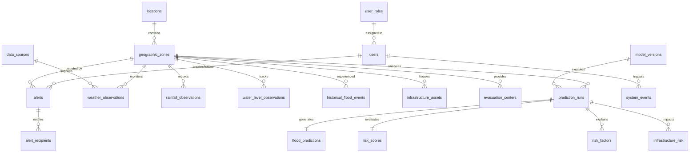

# Document 03 — Database Schema & ERD

**Project Title:** AI-Powered Flood Prediction & Early Warning System  
**Document Version:** 1.0.0  
**Date:** September 9, 2026  
**Status:** Final Draft  

---

## 1. Database Architecture Overview

The database layer utilizes **PostgreSQL 16** enhanced with the **PostGIS 3.4** spatial extension. This relational spatial architecture is specifically designed to store environmental time-series observations alongside spatial vector geometries (polygons and points).

### Key Architectural Choices:
- **Spatial Reference System:** `SRID 4326` (WGS 84 coordinate system using latitude and longitude degrees).
- **PostGIS Types:** `GEOMETRY(Polygon, 4326)` for geographic zone boundaries and flood risk contours; `GEOMETRY(Point, 4326)` for weather stations, river gauges, infrastructure assets, and evacuation centers.
- **Indexing Strategy:** B-Tree indexes on foreign keys, timestamps, and search attributes; **GIST (Generalized Search Tree)** spatial indexes on geometry columns for fast spatial intersections and distance queries.
- **Data Integrity:** Strict foreign key relationships, `NOT NULL` constraints, unique keys, and `CHECK` constraints on ranges (e.g., probability between `0.0` and `1.0`).

---

## 2. Entity Relationship Diagram (ERD)



---

## 3. Data Dictionary & Table Specifications

Below is the complete data dictionary detailing all 20 tables in the system database.

### 3.1 `user_roles`
Stores application user access roles.
- `id` (INT, PK, AUTOINC): Role ID.
- `role_name` (VARCHAR(50), UNIQUE, NOT NULL): Role identifier (`SUPER_ADMIN`, `DISASTER_OFFICER`, `FIELD_RESPONDER`, `PUBLIC_USER`).
- `description` (TEXT): Description of role permissions.
- `created_at` (TIMESTAMP, DEFAULT NOW()): Creation timestamp.

### 3.2 `users`
System user accounts.
- `id` (UUID, PK, DEFAULT gen_random_uuid()): User ID.
- `role_id` (INT, FK -> user_roles.id): Assigned role ID.
- `username` (VARCHAR(100), UNIQUE, NOT NULL): Account username.
- `email` (VARCHAR(255), UNIQUE, NOT NULL): Email address.
- `password_hash` (VARCHAR(255), NOT NULL): BCrypt hashed password string.
- `full_name` (VARCHAR(150)): User's display name.
- `organization` (VARCHAR(150)): Department/Agency name (e.g., "State Disaster Authority").
- `is_active` (BOOLEAN, DEFAULT TRUE): Account active status.
- `created_at` (TIMESTAMP, DEFAULT NOW()): User registration timestamp.

### 3.3 `locations`
Higher-level administrative geographical regions (e.g., District / City).
- `id` (VARCHAR(50), PK): Region code (e.g., `DIST-MUMBAI-01`).
- `name` (VARCHAR(100), NOT NULL): District name.
- `state_name` (VARCHAR(100), NOT NULL): State name.
- `country` (VARCHAR(100), DEFAULT 'India'): Country.
- `bounding_box` (GEOMETRY(Polygon, 4326)): Outer boundary geometry.
- `created_at` (TIMESTAMP, DEFAULT NOW()): Record creation timestamp.

### 3.4 `geographic_zones`
Specific sub-district basins or neighborhood zones monitored for flood risk.
- `id` (VARCHAR(50), PK): Zone code (e.g., `ZONE-NORTH-BASIN`).
- `location_id` (VARCHAR(50), FK -> locations.id): Parent location ID.
- `name` (VARCHAR(150), NOT NULL): Zone name.
- `elevation_mean_m` (DECIMAL(6,2), NOT NULL): Mean elevation above sea level in meters.
- `slope_mean_deg` (DECIMAL(4,2)): Mean terrain slope incline in degrees.
- `drainage_capacity_score` (DECIMAL(4,2)): Drainage performance metric (0.0 to 10.0).
- `soil_permeability_index` (DECIMAL(4,2)): Soil absorption rate.
- `population_density` (DECIMAL(8,2)): Inhabitants per square kilometer for priority ranking.
- `boundary` (GEOMETRY(Polygon, 4326), NOT NULL): Zone GIS polygon vector boundary.
- `centroid` (GEOMETRY(Point, 4326), NOT NULL): Center point location.
- `created_at` (TIMESTAMP, DEFAULT NOW()): Record timestamp.

### 3.5 `data_sources`
Catalog of external meteorological and hydrological data providers.
- `id` (VARCHAR(50), PK): Data source ID (e.g., `SRC-OPEN-METEO`).
- `provider_name` (VARCHAR(100), NOT NULL): Data provider (e.g., "Open-Meteo REST API").
- `source_type` (VARCHAR(50), NOT NULL): Type (`API`, `RIVER_GAUGE_SENSOR`, `DEM_SATELLITE`).
- `update_frequency_minutes` (INT, DEFAULT 15): Ingestion frequency in minutes.
- `status` (VARCHAR(20), DEFAULT 'ACTIVE'): Status (`ACTIVE`, `DEGRADED`, `OFFLINE`).

### 3.6 `weather_observations`
Time-series weather readings per geographic zone.
- `id` (BIGINT, PK, AUTOINC): Observation ID.
- `zone_id` (VARCHAR(50), FK -> geographic_zones.id): Monitored zone ID.
- `source_id` (VARCHAR(50), FK -> data_sources.id): Provider source ID.
- `temperature_c` (DECIMAL(4,1)): Temperature in Celsius.
- `humidity_pct` (DECIMAL(4,1)): Relative humidity percentage.
- `wind_speed_kmh` (DECIMAL(5,1)): Wind speed.
- `observed_at` (TIMESTAMP, NOT NULL): Time of observation.
- `created_at` (TIMESTAMP, DEFAULT NOW()): Ingestion timestamp.

### 3.7 `rainfall_observations`
Detailed precipitation metrics.
- `id` (BIGINT, PK, AUTOINC): Record ID.
- `zone_id` (VARCHAR(50), FK -> geographic_zones.id): Monitored zone ID.
- `source_id` (VARCHAR(50), FK -> data_sources.id): Provider source ID.
- `rainfall_1h_mm` (DECIMAL(6,2), NOT NULL): 1-hour accumulated rainfall in mm.
- `rainfall_6h_mm` (DECIMAL(6,2), NOT NULL): 6-hour accumulated rainfall in mm.
- `rainfall_24h_mm` (DECIMAL(6,2), NOT NULL): 24-hour accumulated rainfall in mm.
- `rainfall_72h_mm` (DECIMAL(6,2), NOT NULL): 72-hour accumulated rainfall in mm.
- `observed_at` (TIMESTAMP, NOT NULL): Timestamp of observation.
- `created_at` (TIMESTAMP, DEFAULT NOW()): Ingestion timestamp.

### 3.8 `water_level_observations`
Hydrodynamic river gauge observations.
- `id` (BIGINT, PK, AUTOINC): Record ID.
- `zone_id` (VARCHAR(50), FK -> geographic_zones.id): Monitored zone ID.
- `river_name` (VARCHAR(100), NOT NULL): River name.
- `gauge_station_id` (VARCHAR(50), NOT NULL): Physical gauge station ID.
- `water_level_m` (DECIMAL(5,2), NOT NULL): Current water level height in meters.
- `warning_level_m` (DECIMAL(5,2), NOT NULL): River warning threshold stage height.
- `danger_level_m` (DECIMAL(5,2), NOT NULL): River danger threshold stage height.
- `discharge_rate_m3s` (DECIMAL(8,2)): Water discharge rate in cubic meters per second.
- `observed_at` (TIMESTAMP, NOT NULL): Timestamp.

### 3.9 `historical_flood_events`
Archive of recorded historical flood incidents used for model training and validation.
- `id` (UUID, PK, DEFAULT gen_random_uuid()): Event ID.
- `zone_id` (VARCHAR(50), FK -> geographic_zones.id): Zone ID.
- `event_date` (DATE, NOT NULL): Date of historic event.
- `peak_water_depth_m` (DECIMAL(4,2)): Peak recorded flood depth in meters.
- `total_rainfall_mm` (DECIMAL(6,2)): Total storm rainfall amount.
- `severity_level` (VARCHAR(20)): Severity (`MINOR`, `MODERATE`, `MAJOR`, `CATASTROPHIC`).
- `notes` (TEXT): Event summary notes.

### 3.10 `model_versions`
Machine learning model registry tracking trained artifacts.
- `id` (VARCHAR(50), PK): Model version tag (e.g., `XGB-FLOOD-V1.0`).
- `model_name` (VARCHAR(100), NOT NULL): Model name (e.g., "XGBoost Flood Predictor").
- `algorithm` (VARCHAR(50), NOT NULL): Algorithm type (`XGBOOST`, `RANDOM_FOREST`).
- `accuracy_roc_auc` (DECIMAL(4,3)): Validation ROC-AUC score.
- `artifact_path` (VARCHAR(255), NOT NULL): Local or cloud path to model `.joblib` file.
- `is_active` (BOOLEAN, DEFAULT TRUE): Production active status flag.
- `trained_at` (TIMESTAMP, DEFAULT NOW()): Training date.

### 3.11 `prediction_runs`
Header record for every AI prediction task executed.
- `id` (UUID, PK, DEFAULT gen_random_uuid()): Run ID.
- `zone_id` (VARCHAR(50), FK -> geographic_zones.id): Targeted zone ID.
- `model_version_id` (VARCHAR(50), FK -> model_versions.id): Executed model version ID.
- `forecast_horizon_hours` (INT, NOT NULL): Forecast lead time (e.g., 3, 6, 12, 24 hours).
- `run_timestamp` (TIMESTAMP, DEFAULT NOW()): Execution time.

### 3.12 `flood_predictions`
Predicted flood metrics generated by AI model run.
- `id` (UUID, PK, DEFAULT gen_random_uuid()): Prediction ID.
- `prediction_run_id` (UUID, FK -> prediction_runs.id): Parent run ID.
- `flood_probability` (DECIMAL(4,3), NOT NULL): Flood probability score (0.000 to 1.000).
- `predicted_depth_m` (DECIMAL(4,2), NOT NULL): Estimated flood depth in meters.
- `confidence_score` (DECIMAL(4,3), NOT NULL): Model statistical confidence score.
- `is_demo_data` (BOOLEAN, DEFAULT FALSE): Badge indicating simulated demo data vs live inference.

### 3.13 `risk_scores`
Synthesized risk categorization for executive decision-making.
- `id` (UUID, PK, DEFAULT gen_random_uuid()): Risk score ID.
- `prediction_run_id` (UUID, FK -> prediction_runs.id): Parent run ID.
- `risk_score_numeric` (DECIMAL(5,2), NOT NULL): Synthesized risk index (0.00 to 100.00).
- `risk_level` (VARCHAR(20), NOT NULL): Risk level (`LOW`, `MODERATE`, `HIGH`, `CRITICAL`).
- `recommended_action` (TEXT, NOT NULL): Guidance text for emergency officials.

### 3.14 `risk_factors`
Explainable AI (SHAP) feature attribution breakdown per prediction.
- `id` (BIGINT, PK, AUTOINC): Factor ID.
- `prediction_run_id` (UUID, FK -> prediction_runs.id): Parent prediction run ID.
- `feature_name` (VARCHAR(100), NOT NULL): Environmental feature name (e.g., "rainfall_24h_mm").
- `feature_value` (DECIMAL(10,2), NOT NULL): Observed feature value.
- `shap_contribution` (DECIMAL(6,3), NOT NULL): SHAP mathematical contribution value (+/-).
- `impact_direction` (VARCHAR(20), NOT NULL): Direction (`INCREASES_RISK`, `DECREASES_RISK`).

### 3.15 `infrastructure_assets`
Public and private critical infrastructure objects monitored for flood impact.
- `id` (VARCHAR(50), PK): Asset ID (e.g., `ASSET-HOSP-01`).
- `zone_id` (VARCHAR(50), FK -> geographic_zones.id): Housing zone ID.
- `name` (VARCHAR(150), NOT NULL): Facility name (e.g., "City General Hospital").
- `asset_type` (VARCHAR(50), NOT NULL): Type (`HOSPITAL`, `POWER_SUBSTATION`, `SCHOOL`, `WATER_TREATMENT`, `BRIDGE`).
- `elevation_m` (DECIMAL(6,2), NOT NULL): Ground elevation height in meters.
- `capacity` (INT): Facility occupancy/capacity count.
- `location` (GEOMETRY(Point, 4326), NOT NULL): GIS Point coordinates.
- `created_at` (TIMESTAMP, DEFAULT NOW()): Record timestamp.

### 3.16 `infrastructure_risk`
Spatial risk evaluation connecting prediction runs to impacted assets.
- `id` (BIGINT, PK, AUTOINC): Record ID.
- `prediction_run_id` (UUID, FK -> prediction_runs.id): Parent prediction run ID.
- `asset_id` (VARCHAR(50), FK -> infrastructure_assets.id): Evaluated asset ID.
- `vulnerability_status` (VARCHAR(20), NOT NULL): Status (`SAFE`, `AT_RISK`, `INUNDATED`).
- `estimated_water_depth_m` (DECIMAL(4,2), DEFAULT 0.00): Water depth at asset.
- `recommended_protection` (TEXT): Recommended action (e.g., "Deploy mobile sandbag barrier").

### 3.17 `evacuation_centers`
Designated emergency shelters and safe hubs.
- `id` (VARCHAR(50), PK): Center ID (e.g., `SHELTER-NORTH-01`).
- `name` (VARCHAR(150), NOT NULL): Shelter facility name.
- `address` (TEXT, NOT NULL): Physical address.
- `max_capacity` (INT, NOT NULL): Maximum human capacity.
- `current_occupancy` (INT, DEFAULT 0): Current occupancy count.
- `has_backup_power` (BOOLEAN, DEFAULT TRUE): Utility redundancy.
- `location` (GEOMETRY(Point, 4326), NOT NULL): GIS Point location.
- `is_active` (BOOLEAN, DEFAULT TRUE): Operating status.

### 3.18 `alerts`
Issued emergency flood warning bulletins.
- `id` (UUID, PK, DEFAULT gen_random_uuid()): Alert ID.
- `zone_id` (VARCHAR(50), FK -> geographic_zones.id): Targeted zone ID.
- `issued_by_user_id` (UUID, FK -> users.id): Issuing officer user ID.
- `severity` (VARCHAR(20), NOT NULL): Level (`YELLOW_ADVISORY`, `ORANGE_WARNING`, `RED_EMERGENCY`).
- `title` (VARCHAR(200), NOT NULL): Alert headline.
- `message` (TEXT, NOT NULL): Detailed public warning message.
- `status` (VARCHAR(20), DEFAULT 'ACTIVE'): Status (`DRAFT`, `ACTIVE`, `CANCELLED`, `EXPIRED`).
- `issued_at` (TIMESTAMP, DEFAULT NOW()): Time of issuance.
- `expires_at` (TIMESTAMP, NOT NULL): Alert expiration timestamp.

### 3.19 `alert_recipients`
Log of target groups receiving alert notifications.
- `id` (BIGINT, PK, AUTOINC): Record ID.
- `alert_id` (UUID, FK -> alerts.id): Parent alert ID.
- `recipient_group` (VARCHAR(50), NOT NULL): Target channel (`PUBLIC_PORTAL`, `FIELD_TEAMS_SMS`, `DISTRICT_OFFICIALS_EMAIL`).
- `delivery_status` (VARCHAR(20), DEFAULT 'DELIVERED'): Status (`PENDING`, `DELIVERED`, `FAILED`).
- `sent_at` (TIMESTAMP, DEFAULT NOW()): Dispatch timestamp.

### 3.20 `system_events`
Audit log recording system activity, errors, and manual overrides.
- `id` (BIGINT, PK, AUTOINC): Log ID.
- `user_id` (UUID, FK -> users.id, NULLABLE): Triggering user ID.
- `event_type` (VARCHAR(50), NOT NULL): Category (`MODEL_INFERENCE`, `ALERT_PUBLISHED`, `DATA_INGEST_ERROR`).
- `message` (TEXT, NOT NULL): Log description text.
- `event_timestamp` (TIMESTAMP, DEFAULT NOW()): Timestamp.

---

## 4. Executable PostgreSQL DDL Script

Below is the complete executable DDL script creating all tables, PostGIS extensions, constraints, and indexes.

```sql
-- Enable PostGIS spatial extension
CREATE EXTENSION IF NOT EXISTS postgis;

-- 1. user_roles
CREATE TABLE user_roles (
    id SERIAL PRIMARY KEY,
    role_name VARCHAR(50) UNIQUE NOT NULL,
    description TEXT,
    created_at TIMESTAMP DEFAULT CURRENT_TIMESTAMP
);

-- 2. users
CREATE TABLE users (
    id UUID PRIMARY KEY DEFAULT gen_random_uuid(),
    role_id INT NOT NULL REFERENCES user_roles(id),
    username VARCHAR(100) UNIQUE NOT NULL,
    email VARCHAR(255) UNIQUE NOT NULL,
    password_hash VARCHAR(255) NOT NULL,
    full_name VARCHAR(150),
    organization VARCHAR(150),
    is_active BOOLEAN DEFAULT TRUE,
    created_at TIMESTAMP DEFAULT CURRENT_TIMESTAMP
);

-- 3. locations
CREATE TABLE locations (
    id VARCHAR(50) PRIMARY KEY,
    name VARCHAR(100) NOT NULL,
    state_name VARCHAR(100) NOT NULL,
    country VARCHAR(100) DEFAULT 'India',
    bounding_box GEOMETRY(Polygon, 4326),
    created_at TIMESTAMP DEFAULT CURRENT_TIMESTAMP
);

-- 4. geographic_zones
CREATE TABLE geographic_zones (
    id VARCHAR(50) PRIMARY KEY,
    location_id VARCHAR(50) NOT NULL REFERENCES locations(id),
    name VARCHAR(150) NOT NULL,
    elevation_mean_m DECIMAL(6,2) NOT NULL,
    slope_mean_deg DECIMAL(4,2),
    drainage_capacity_score DECIMAL(4,2) CHECK (drainage_capacity_score BETWEEN 0 AND 10),
    soil_permeability_index DECIMAL(4,2),
    population_density DECIMAL(8,2),
    boundary GEOMETRY(Polygon, 4326) NOT NULL,
    centroid GEOMETRY(Point, 4326) NOT NULL,
    created_at TIMESTAMP DEFAULT CURRENT_TIMESTAMP
);

-- 5. data_sources
CREATE TABLE data_sources (
    id VARCHAR(50) PRIMARY KEY,
    provider_name VARCHAR(100) NOT NULL,
    source_type VARCHAR(50) NOT NULL,
    update_frequency_minutes INT DEFAULT 15,
    status VARCHAR(20) DEFAULT 'ACTIVE'
);

-- 6. weather_observations
CREATE TABLE weather_observations (
    id BIGSERIAL PRIMARY KEY,
    zone_id VARCHAR(50) NOT NULL REFERENCES geographic_zones(id),
    source_id VARCHAR(50) REFERENCES data_sources(id),
    temperature_c DECIMAL(4,1),
    humidity_pct DECIMAL(4,1),
    wind_speed_kmh DECIMAL(5,1),
    observed_at TIMESTAMP NOT NULL,
    created_at TIMESTAMP DEFAULT CURRENT_TIMESTAMP
);

-- 7. rainfall_observations
CREATE TABLE rainfall_observations (
    id BIGSERIAL PRIMARY KEY,
    zone_id VARCHAR(50) NOT NULL REFERENCES geographic_zones(id),
    source_id VARCHAR(50) REFERENCES data_sources(id),
    rainfall_1h_mm DECIMAL(6,2) NOT NULL CHECK (rainfall_1h_mm >= 0),
    rainfall_6h_mm DECIMAL(6,2) NOT NULL CHECK (rainfall_6h_mm >= 0),
    rainfall_24h_mm DECIMAL(6,2) NOT NULL CHECK (rainfall_24h_mm >= 0),
    rainfall_72h_mm DECIMAL(6,2) NOT NULL CHECK (rainfall_72h_mm >= 0),
    observed_at TIMESTAMP NOT NULL,
    created_at TIMESTAMP DEFAULT CURRENT_TIMESTAMP
);

-- 8. water_level_observations
CREATE TABLE water_level_observations (
    id BIGSERIAL PRIMARY KEY,
    zone_id VARCHAR(50) NOT NULL REFERENCES geographic_zones(id),
    river_name VARCHAR(100) NOT NULL,
    gauge_station_id VARCHAR(50) NOT NULL,
    water_level_m DECIMAL(5,2) NOT NULL,
    warning_level_m DECIMAL(5,2) NOT NULL,
    danger_level_m DECIMAL(5,2) NOT NULL,
    discharge_rate_m3s DECIMAL(8,2),
    observed_at TIMESTAMP NOT NULL
);

-- 9. historical_flood_events
CREATE TABLE historical_flood_events (
    id UUID PRIMARY KEY DEFAULT gen_random_uuid(),
    zone_id VARCHAR(50) NOT NULL REFERENCES geographic_zones(id),
    event_date DATE NOT NULL,
    peak_water_depth_m DECIMAL(4,2),
    total_rainfall_mm DECIMAL(6,2),
    severity_level VARCHAR(20),
    notes TEXT
);

-- 10. model_versions
CREATE TABLE model_versions (
    id VARCHAR(50) PRIMARY KEY,
    model_name VARCHAR(100) NOT NULL,
    algorithm VARCHAR(50) NOT NULL,
    accuracy_roc_auc DECIMAL(4,3),
    artifact_path VARCHAR(255) NOT NULL,
    is_active BOOLEAN DEFAULT TRUE,
    trained_at TIMESTAMP DEFAULT CURRENT_TIMESTAMP
);

-- 11. prediction_runs
CREATE TABLE prediction_runs (
    id UUID PRIMARY KEY DEFAULT gen_random_uuid(),
    zone_id VARCHAR(50) NOT NULL REFERENCES geographic_zones(id),
    model_version_id VARCHAR(50) NOT NULL REFERENCES model_versions(id),
    forecast_horizon_hours INT NOT NULL CHECK (forecast_horizon_hours > 0),
    run_timestamp TIMESTAMP DEFAULT CURRENT_TIMESTAMP
);

-- 12. flood_predictions
CREATE TABLE flood_predictions (
    id UUID PRIMARY KEY DEFAULT gen_random_uuid(),
    prediction_run_id UUID UNIQUE NOT NULL REFERENCES prediction_runs(id) ON DELETE CASCADE,
    flood_probability DECIMAL(4,3) NOT NULL CHECK (flood_probability BETWEEN 0.000 AND 1.000),
    predicted_depth_m DECIMAL(4,2) NOT NULL CHECK (predicted_depth_m >= 0.00),
    confidence_score DECIMAL(4,3) NOT NULL CHECK (confidence_score BETWEEN 0.000 AND 1.000),
    is_demo_data BOOLEAN DEFAULT FALSE
);

-- 13. risk_scores
CREATE TABLE risk_scores (
    id UUID PRIMARY KEY DEFAULT gen_random_uuid(),
    prediction_run_id UUID UNIQUE NOT NULL REFERENCES prediction_runs(id) ON DELETE CASCADE,
    risk_score_numeric DECIMAL(5,2) NOT NULL CHECK (risk_score_numeric BETWEEN 0.00 AND 100.00),
    risk_level VARCHAR(20) NOT NULL,
    recommended_action TEXT NOT NULL
);

-- 14. risk_factors
CREATE TABLE risk_factors (
    id BIGSERIAL PRIMARY KEY,
    prediction_run_id UUID NOT NULL REFERENCES prediction_runs(id) ON DELETE CASCADE,
    feature_name VARCHAR(100) NOT NULL,
    feature_value DECIMAL(10,2) NOT NULL,
    shap_contribution DECIMAL(6,3) NOT NULL,
    impact_direction VARCHAR(20) NOT NULL
);

-- 15. infrastructure_assets
CREATE TABLE infrastructure_assets (
    id VARCHAR(50) PRIMARY KEY,
    zone_id VARCHAR(50) NOT NULL REFERENCES geographic_zones(id),
    name VARCHAR(150) NOT NULL,
    asset_type VARCHAR(50) NOT NULL,
    elevation_m DECIMAL(6,2) NOT NULL,
    capacity INT,
    location GEOMETRY(Point, 4326) NOT NULL,
    created_at TIMESTAMP DEFAULT CURRENT_TIMESTAMP
);

-- 16. infrastructure_risk
CREATE TABLE infrastructure_risk (
    id BIGSERIAL PRIMARY KEY,
    prediction_run_id UUID NOT NULL REFERENCES prediction_runs(id) ON DELETE CASCADE,
    asset_id VARCHAR(50) NOT NULL REFERENCES infrastructure_assets(id),
    vulnerability_status VARCHAR(20) NOT NULL,
    estimated_water_depth_m DECIMAL(4,2) DEFAULT 0.00,
    recommended_protection TEXT
);

-- 17. evacuation_centers
CREATE TABLE evacuation_centers (
    id VARCHAR(50) PRIMARY KEY,
    name VARCHAR(150) NOT NULL,
    address TEXT NOT NULL,
    max_capacity INT NOT NULL CHECK (max_capacity > 0),
    current_occupancy INT DEFAULT 0 CHECK (current_occupancy >= 0),
    has_backup_power BOOLEAN DEFAULT TRUE,
    location GEOMETRY(Point, 4326) NOT NULL,
    is_active BOOLEAN DEFAULT TRUE
);

-- 18. alerts
CREATE TABLE alerts (
    id UUID PRIMARY KEY DEFAULT gen_random_uuid(),
    zone_id VARCHAR(50) NOT NULL REFERENCES geographic_zones(id),
    issued_by_user_id UUID NOT NULL REFERENCES users(id),
    severity VARCHAR(20) NOT NULL,
    title VARCHAR(200) NOT NULL,
    message TEXT NOT NULL,
    status VARCHAR(20) DEFAULT 'ACTIVE',
    issued_at TIMESTAMP DEFAULT CURRENT_TIMESTAMP,
    expires_at TIMESTAMP NOT NULL
);

-- 19. alert_recipients
CREATE TABLE alert_recipients (
    id BIGSERIAL PRIMARY KEY,
    alert_id UUID NOT NULL REFERENCES alerts(id) ON DELETE CASCADE,
    recipient_group VARCHAR(50) NOT NULL,
    delivery_status VARCHAR(20) DEFAULT 'DELIVERED',
    sent_at TIMESTAMP DEFAULT CURRENT_TIMESTAMP
);

-- 20. system_events
CREATE TABLE system_events (
    id BIGSERIAL PRIMARY KEY,
    user_id UUID REFERENCES users(id),
    event_type VARCHAR(50) NOT NULL,
    message TEXT NOT NULL,
    event_timestamp TIMESTAMP DEFAULT CURRENT_TIMESTAMP
);

-- CREATE GIST SPATIAL INDEXES
CREATE INDEX idx_locations_bbox ON locations USING GIST (bounding_box);
CREATE INDEX idx_geographic_zones_boundary ON geographic_zones USING GIST (boundary);
CREATE INDEX idx_geographic_zones_centroid ON geographic_zones USING GIST (centroid);
CREATE INDEX idx_infrastructure_assets_loc ON infrastructure_assets USING GIST (location);
CREATE INDEX idx_evacuation_centers_loc ON evacuation_centers USING GIST (location);

-- CREATE B-TREE INDEXES FOR SPEED
CREATE INDEX idx_weather_zone_time ON weather_observations(zone_id, observed_at DESC);
CREATE INDEX idx_rainfall_zone_time ON rainfall_observations(zone_id, observed_at DESC);
CREATE INDEX idx_water_level_zone_time ON water_level_observations(zone_id, observed_at DESC);
CREATE INDEX idx_prediction_runs_zone ON prediction_runs(zone_id, run_timestamp DESC);
CREATE INDEX idx_alerts_zone_status ON alerts(zone_id, status);
CREATE INDEX idx_system_events_time ON system_events(event_timestamp DESC);
```
